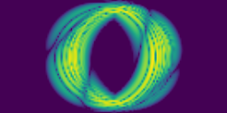
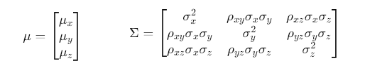

<!--# Table of Contents
1. [Example](#example)
2. [Example2](#example2)
3. [Third Example](#third-example)
4. [Fourth Example](#fourth-examplehttpwwwfourthexamplecom)

## Example
## Example2
## Third Example
## [Fourth Example](http://www.fourthexample.com) 
-->

# Strong Field Ionization and Machine Learning

## Overview
* H2+ ion is ionized by a strong, short light pulse 🠒 tunnle ionization.
* Strong-field approximation (SFA) is used to calculate a dataset of momentum spectra.
* Machine learning models are utilized to predict the atomic nucleus distance and other quantities.
* The predictions for the quantities turn out to be correlated.
* A diffusion model is able to create momentum spectra which can be used as a dataset for other models.
* Atomic units are used

## Dataset
Using the SFA-Algorithm, a dataset of 10k images was created in which seven parameters were varied. A neural network is utilized to solve the *inverse problem*, i. e. for a given momentum spectrum it predicts the underlying seven parameters. 

Quantity | Meaning | Min | Max
---------|---------|-----|-------
N | number of laser cycles | 2 | 6
F0 |electric field amplitude | 0.01 | 0.08
ω | electric field frequency | 0.03 | 0.08
φ | carrier-envelope phase | 0 | 2π
R | distance of atoms | 3 | 9
α | orientation atoms to polarization | 0 | π
gsengy | ground state energy | -1.0 | -0.2

## Inverse Problem
While mapping the seven parameters to a momentum spectrum is an easy task (though computationally demanding, if no approximations are used), the inverse mapping is quite difficult. Machine learning can be used to solve this inverse problem. 
By training a CNN in a supervised manner, we are able to retrieve most of the parameters that were used to compute a momentum spectrum. To prevent overfitting, a small portion of gaussian noise can be overlaid to the momentum spectrum.
Quantity | Mean absolute error
---------| -------------------
N | 0.54
F0 | 0.005
ω | 0.005
φ | 1.31
R | 0.281
α | 0.084
gsengy | 0.047

Considering that many parameters were varied, these are decent results. All quantities but φ, the carrier-envelope phase, can be retrieved.

 

With another model which is given all parameters but R, we achieve a mean absolute error of 0.243 for R.

## Gaussian models
The output of the machine learning model is a point in the seven dimensional space. However, we could also model the output to be a gaussian distribution. In that case, the output of the neural network is a mean value µ (seven dimensional) and a symmetric positive definite covariance matrix Σ (7x7) which model a multidimensional gaussian distribution  
 
The output of the neural network then is a probability distribution. The loss which is used to optimize the model, is a negative log-likelihood. The log-likelihood is a typical optimization target in stochastic regression when random samples are given and a probability distribution is to be fitted. In one dimension, the negative log-likelihood look like this: 
 
where µ and σ are the neural networks output quantities and x_j are the ground truth values. Note that for fixed σ, this is (up to a scale factor and an additive constant) identical to the mean squared error which is used troughout the machine learning literature. Also note that the negative log-likelihood can become negative. 
Projected to the two dimensional parameter space the Gaussian probability distribution can look this: 
 
The red dot is the ground truth value of F0 and ω in the parameter space. As we see, the networks prediction has an extension due to the uncertainty of the ground truth value from the perspective of the neural network. However, the uncertainties of both variables are correlated. The parameter ρ = 0.55 measures the correlation of quantities. m = 1.37 is the ratio of both standard deviations, i. e. the "slope" of the distribution. 
Given one quantity, the prediction µ for the other variable can be corrected. The mean absolute error for R can be decreased by 8 % if the other six parameters are given to the network.

## Correlation of quantities
It turns out, that many quantities are correlated/entangled. For example, R and F0 are quite correlated: 
 
These are 500 samples from the validation set. As before, ρ is the correlation of both quantities, where ρ = ± 1 means perfect (anti-)correlation, and m is the absolute value of the ratio of the uncertainties of both quantities.
One cluster of entangled quantities are F0, ω and the ground state energy. 
 
The interpretation of these correlations is as follows: The model has some uncertainty for the three parameters F0, omega and ground state energy. However, the uncertainties are not independent of each other. Instead, the probability distribution of the parameters prediction is a thin, three dimensional ellipsoid. If one quantity is varied, for example F0, then the other parameters also have to vary, to be consistent with the underlying momentum distribution. 
Note that the ratio of the uncertainties ΔF0 and Δω is in the order of magnitude of 1 a. u. This perfectly matches the ratio of F0 to ω, as both parameters are in the order of magnitude of ~0.05 a. u. respectively. If we plot the ratios ΔF0/Δω and F0/ω, we see that both ratios are almost perfectly identical: 
 
This is strong indication that the network can determine A0 = F0/ω quite exact (note that (F0+ΔF0)/(ω+Δω) = const implies ΔF0/Δω ≈ F0/ω), while it is more difficult to extract both quantities F0 and ω afterwards.

## Diffusion Model
Diffusion models are generative models which work by denoising images. Trained on a set of true images, they learn to mimic this dataset. The basic principle of the images generation is, that a noising process is reversed. In the trainig process, an image is stepwise overlayed with noise. The model learns to reverse each step is thereby learns the process of creating an image starting with pure noise. The (de-)noising schedule consists of one thousand noising or denoising steps. 
 
Since the resolution of 128x64 is quite challenging, a VQVAE (vector quantized variational autoencoder) was utilized to compress the images by a factor of 4 in width and height to a latent format of 32x16 with 4 latent channels in each pixel. 

The results are decent. The images are a bit blurry, but most of the structure (interference rings etc.) are captured by the output images. Such moodels can be utilized to produce spectra which are much more computationally demanding than SFA images.

**NOTE:** The diffusion model is not completely converged when these images where created.
Quantity varied | Diffusion model | Classic algorithm (SFA)
----------------|-----------------|-------------------
F0 🠒 min |  | 
R 🠒 min |  | 
R 🠒 max |  | 
ω 🠒 min |  | 
gsengy 🠒 min |  | 
gsengy 🠒 max |  | 
<!--
N 🠒 max |  | 
ω 🠒 max |  | 
F0 🠒 max |  | 
gsengy 🠒 min |  | 
 -->
The parameters - if not maximized/minimized - are: N = 2; F0 = 0.04; ω = 0.03; φ = 0.94; R = 5; α = 1; gsenergy = -0.41

## Training on a shortened dataset
In many cases, creating a dataset of 10k instances is not possible. For example, without the strong-field approximation, it is computationally much more demanding to calculate momentum spectra. Data generated by a diffusion model can help overcoming that data shortage. 
As an extreme case, a model was trained with only 200 labeled momentum spectra. Then, another model was trained with the data of the diffusion model. The diffusion model also was only trained with the small dataset. The mean absolute error for R was decreased from 0.535 to 0.451 which is a decrease by 16 %.

 ## Appendix A: GIFs of the SFA und Generated Momentum Distributions
 Quantity varied |  Animation SFA 
 ----------------|----------------
 N | 
 F0 | 
 ω|
 φ | 
 R |  
α| 
 ground state energy | 
 <!-- 
 -->

## Appendix B: Conditioned Probability Distributions
Above we talked about multidimensional Gaussians. Knowing about one or more parameters gives information about the others. The following formulas describe the shifted expectation values µ and the narrowed standard deviations σ. Let's assume we have a three-dimensional distribution and y and z are given:

Then we write the covariance matrix into a block form: 
 
where 
 
When y and z are known, the statistical values µ and σ for are shifted/narrowed: 
 
 

##  Appendix C: Integration along the Uncertainty Ellipsoid
As mentioned above, the model has an uncertainty about the various parameters and these uncertainties are correlated. What would happen if we moved along that direction of greatest uncertainty? 
The following table shows how one or more parameters are varied. In the case of two or more quantities, they are changed in the n-dimensional parameter space such that the uncertainty is maximal. The graphs in the middle column show how the parameters vary, and the GIF in the right column shows all the steps combined into an animation.

Parameters varied | Parameters | GIF
----------|-----------|-----------
F0 | |
 F0, ω | |
 R, F0, ω | |
 R, F0, ω, gs_energy | |

As we can see, when only F0 changes, the momentum spectrum varies a lot. The more quantities we change, the more static the spectrum appears.
 
  <!--
 R, F0, ω, gs_energy, α | |
  R | | -->

## Appendix D: Implementation of the SFA ALgorithm on the GPU
Creating a dataset of 10k images is computationally demanding and one might look for ways to speed up the computation. 
Python is a slow, script-based language. With packages such as Numba we are able to compile Python code into C code *just in time*. On the other hand, machine learning packages like Tensorflow or PyTorch give
us the opportunity to perform calculations directly on the GPU. By calculating more than one spectrum at a time, the calculation is accelerated by orders of magnitude.
Method | Device | Batch size | Integration Speed
-------|--------|----|------
Python | CPU | 1 | 98 it/s
PyTorch | CPU | 1 | 110 it/s
PyTorch | GPU | 1 | 830 it/s
PyTorch | GPU | 5 | 1200 it/s
PyTorch | GPU | 10 | 3700 it/s
PyTorch | GPU | 100 | 5300 it/s
PyTorch | GPU | 250 | 5500 it/s

At the same time, it is not too difficult to write up PyTorch code to run on the GPU. Here is the complete routine for the SFA calculations. 
